关键词： 新一代神经网络，STDP，脉冲神经网络，SNN，少样本学习，人工设计先天连接

# 概述

1. 首先会概述需要什么机制

   包括所需细胞类型、兴奋及脉冲发放的相关机制、连接强化的相关机制。

   会提出一些猜想，关于如何利用STDP机制分配全连接层上的细胞（分配地址机制），详见【连接强化的相关机制】部分。还会提出神经元如何记录顺序信息的猜想，详见【还需注意】部分。

2. 然后探讨如果用算法的方式实现，应该要做什么优化

3. 最后会给出一个局部特征学习的应用例子

   通过人工设计来形成先天的连接，加上利用hebb学习机制来形成后天的连接，这能实现少样本学习局部特征。

# 需要什么机制

## 所需细胞类型

- 兴奋细胞
  兴奋后会以一定的频率发放脉冲，发放完一定量的脉冲后，会自行恢复到静息状态
  这里的细胞分为两个子类：
  一种是短期记忆细胞，有只能短期维持强化效果的连接。另一种是长期记忆细胞，有可以长期维持强化效果的连接

- 快发放抑制细胞
  短时间发出频率极高的脉冲，为了产生快速抑制的效果
  有很多地方需要用到，稀疏激活的实现也需要
  
- 普通抑制细胞
  以正常的频率发出脉冲，作用于兴奋细胞

- 去抑制细胞
  只作用于普通抑制细胞，通过抑制普通抑制细胞，达到去抑制的作用

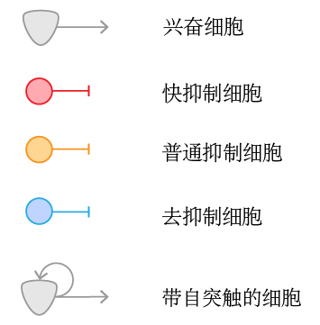

图 1-1-1 各类细胞示意

- 带自突触的兴奋细胞

  此类细胞兴奋后会一直维持兴奋状态，直到激活上层细胞。此时触发取消兴奋机制，即，上层细胞会激活快抑制细胞，来抑制下层的细胞

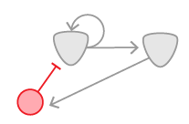

图 1-1-2 带自突触细胞的取消兴奋示意

## 兴奋及脉冲发放的相关机制

### 1.兴奋相关的变量

**时间窗口：**在短时间内收到足够的脉冲，细胞才能兴奋，这一小段时间的限定称为时间窗口。

​		生物上是通过膜电位衰减实现的，主要是为了避免之前累积的膜电位不会影响到当前的兴奋计算。

**初始发放频率：**不同类型的细胞有不同的初始发放频率

**连接权值：**连接有一个初始的权值，强化后连接权值会增加

**累积权值：**每收到一次脉冲会累积一些权值，累积的权值与连接权值相关
​		用生物学的术语来说，就是细胞的膜电位

**相对阈值：**收到足够的脉冲，使累积权值达到相对阈值，细胞则会兴奋
		生物上的神经元的阈值电位基本是固定的，但是可以通过受体通道开放时间和受体数量来变相的实现不同的阈值，这里用相对阈值这个变量来表示

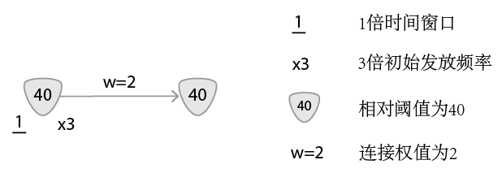

图 1-2-1 相关变量的符号表示例子 

### 2.兴奋机制的大致过程

细胞只有在时间窗口内收到足够的脉冲，使其累积权值达到相对阈值，细胞才会兴奋，发出脉冲。之后累积权值会清除，准备下一轮的兴奋

超出时间窗口后，细胞仍未兴奋，累积权值也会清除

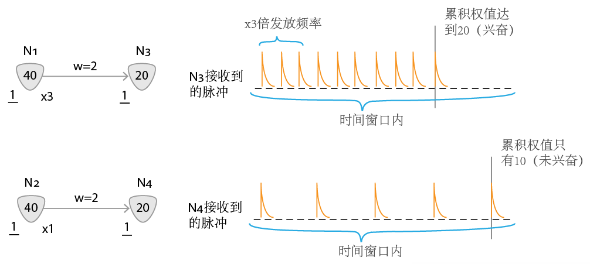

图 1-2-2 兴奋机制示意 

### 3.其他特性

#### 3.1稀疏激活

第二层有很多细胞都会收到脉冲，但是被激活的只有少数，这称为稀疏激活，这能显著减少计算量

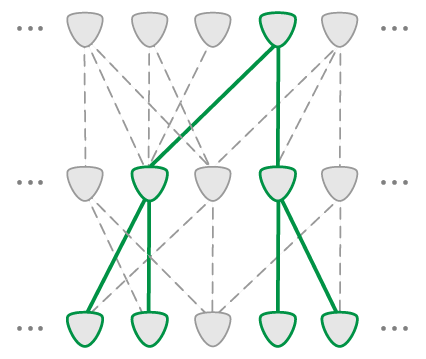

图 1-2-3-1 稀疏激活示意

#### 3.2多倍的输入会导致多倍的发放频率

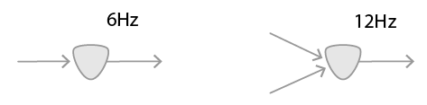

图 1-2-3-2 多倍输入导致多倍发放频率示意

## 连接强化的相关机制

### 1.依靠前馈强化

在某些负责后天记忆的脑区，会有类似下图的全连接层。

形成后天记忆的方式就是强化它们之间的连接，如下图所示：

 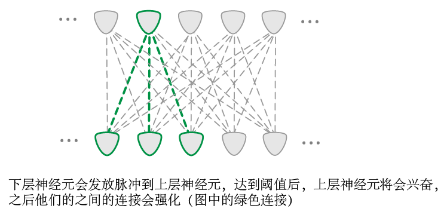

图 1-3-1 强化的全连接层示例

强化过的连接，下一次就能释放更多递质，即连接会传递更高的权值给上层细胞

### 2.分配地址

为了确保不要分配两个细胞来记录同一段信息，需要分配地址机制。可以通过STDP（Spike-timing-dependent plasticity）机制来实现。

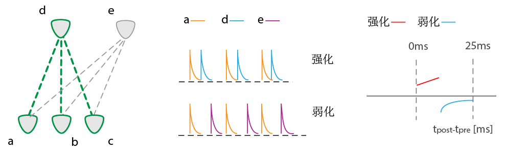

图 1-3-2 分配地址机制示意

生物层面上，由于连接的长度不同以及各种其他因素的影响，总会有一个上层细胞先兴奋。

以上图为例，由于e细胞比d细胞兴奋的慢，根据STDP机制，a与d细胞间的连接会被强化，而a与e细胞间的连接会被弱化（见上图右侧的脉冲示意图）。从而确保不会分配两个细胞来记录同样的信息

### 3.已分配细胞的占有机制

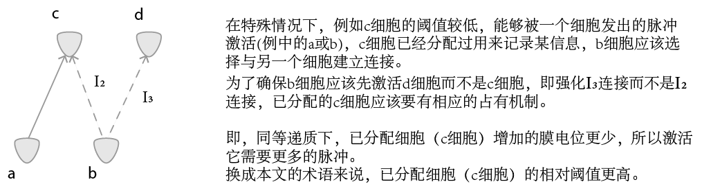

图 1-3-3 占有机制示意

## 还需注意

### 1.记录顺序信息

#### 1.1如何形成

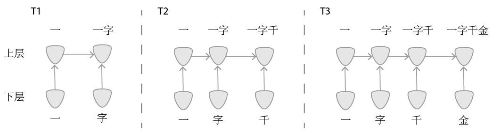

下层"一"细胞先激活上层"一"细胞，之后上层"一"细胞兴奋，抑制下层"一"细胞。此时"字"细胞兴奋，与上层"一"细胞共同激活"一字"细胞。以此类推，最终形成"一字千金"这种顺序信息的储存。

#### 1.2如何检索

以"一字千金"和"一字不苟"这两成语为例：

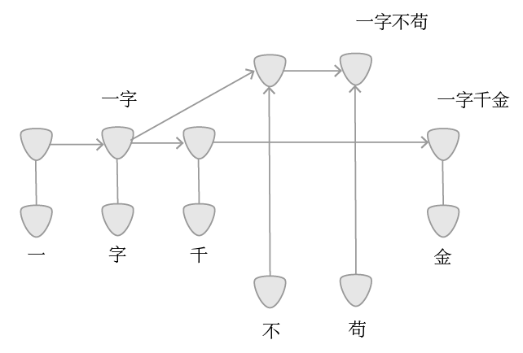

如果第三个字是"千"，那么"一字千"细胞会先兴奋，之后"一字"细胞会被快速抑制，

所以"一字不"细胞不会激活，最后兴奋的就是"一字千金"细胞

### 2.快发放抑制细胞链

某些脑区会有这种环路，这是需要模拟的

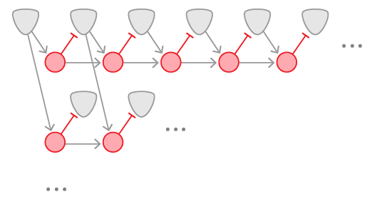

图 1-4-2-1 快发放抑制细胞链示例

# 算法实现

脉冲神经网络过度的模仿生物神经元上琐碎的细节，而带有反向传播的人工神经网络，与生物神经元有较大差别，海月网络就是为了解决上述问题而提出的。

## 优势

- 时间复杂度较低

  由于细胞是稀疏激活的，时间复杂度会较低

  用了一些数据结构上的优势，替代了STDP机制，时间复杂度显著减少

-   可容纳的节点数多

    由于是事件驱动的稀疏激活，使得可以容纳较多节点而不大幅增加计算量

## 主要的优化

- 替代STDP机制

  STDP机制的模拟需要花费过多的计算量，而STDP机制主要的功能是确保同时兴奋的神经元间的连接的强化以及上面所说的分配地址机制。如果用算法实现，那么可以利用上一些数据结构上的优势，从而避免模拟STDP机制，实现同样的功能

- 快抑制细胞的优化

  为了减少计算量，高频率脉冲改成单次大权值脉冲，这也能实现同样的功能

- 快抑制细胞的传递性回路

  因为要实现快速抑制，用递归实现

- 为了减少计算量，适当的把高频率低权值，改成低频率高权值

## 细节与实现方式

[算法部分链接](神经网络部分.md)

# 应用例子

先天连接的形成通过人工初始，后天连接的形成只需hebb学习机制

下面给出一个局部特征识别的例子

通过把V1\>V2\>V4这些很有规律的连接用脚本的方式初始化。之后V4\>PIT\>vmPOS 这部分只需通过喂养显著特征，之后通过神经元前馈的方式形成连接。

[局部特征识别链接](局部特征识别例子.md)

整体轮廓识别的部分仍在制作，过一段时间后发布
