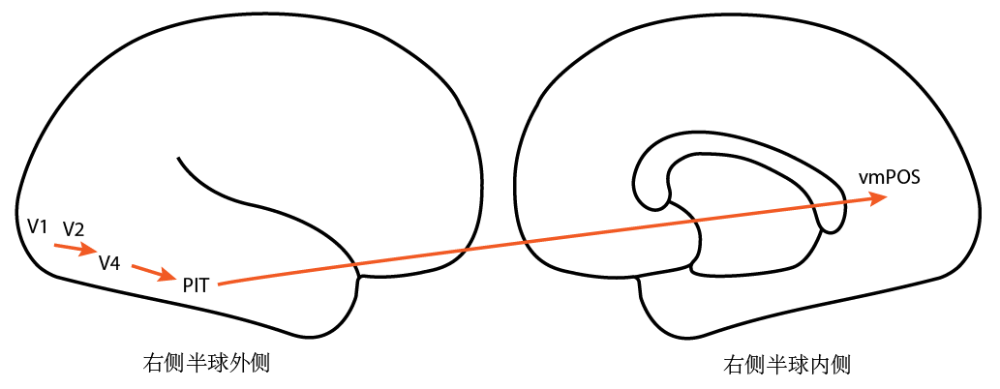
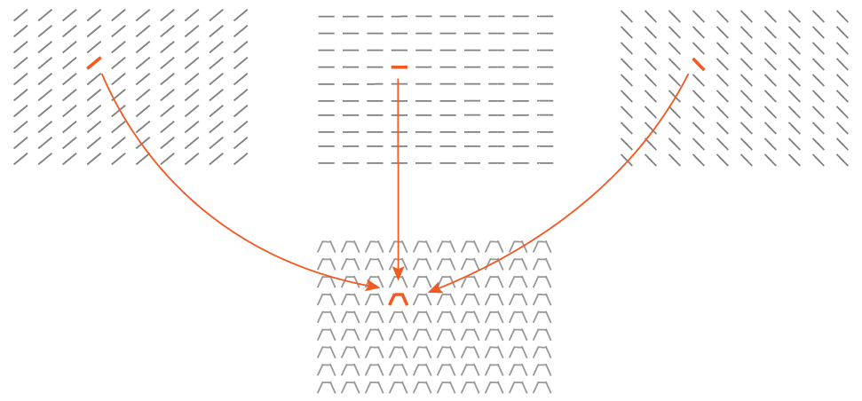
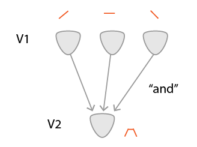
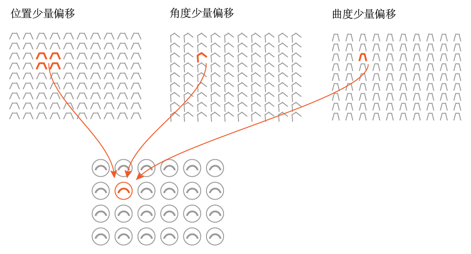
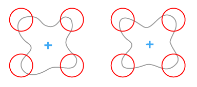
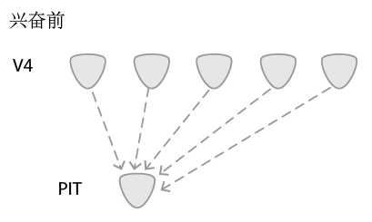
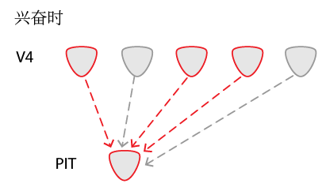
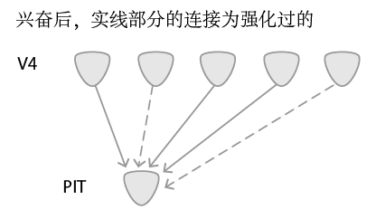
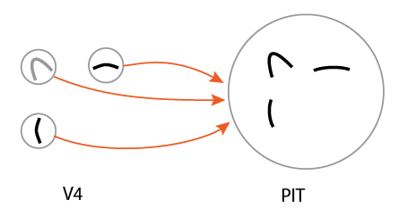

# 局部特征处理

## 第一部分：大致通路及处理过程

局部特征处理的相关脑区通路：

大致处理过程：

注意：这些特征的大小都在眼的视野范围

## 第二部分：神经环路实现

### 1.V1区到V2区

想象一群只检测某方位小边的感受器，平铺在视野中。

 

​		(示意图，实际比这密集得多)

上图的这群感受器只检测45°的小边，而V1脑区有各种感受不同方位小边的感受器群（例如：0°、15、...、60°、...）

现在，把这些感受器以某种有规律的方式组合（如下图）

那么就可以组成一堆只响应某种曲线的感受器，这就是V1区到V2区神经元做的事情，下图为神经元连接

### 2.V2/V3区到V4区

类似V1到V2区的感受器，V2/V3区到V4区通过以下方式组合

下图为神经元连接:

注意，这里是"or"而不是V1区到V2区的"and"。意思是只需其中一个V3神经元就能激活V4神经元。即，某范围内的位置、角度或曲度少量偏移的V3感受器，都能激活V4感受器。

**这样能提升鲁棒性。例如，下图的两个相似但有差异的形状，总能激活同样的4个V4神经元。** 

	 
 (图中蓝色+号为注视中心，红圈为V4区的感受器)  

### 3.V4区到 PIT区

上面脑区的连接都是先天形成的，在婴儿还没睁开眼睛前就已经形成。而V4区到 PIT区这部分，是后天学习得到的，即，利用突触可塑性的基本原理强化连接。

首先，V4和PIT有一层没强化的连接，如下图

之后，V4区中有一些神经元会兴奋，发出脉冲，使PIT区中的某个神经元兴奋

最后，这些神经元间的连接会被强化

那么通过这种方式，就可以记住某些局部特征

### 4.PIT \> vmPOS

类似V4区到PIT区的实现方式，不再论述