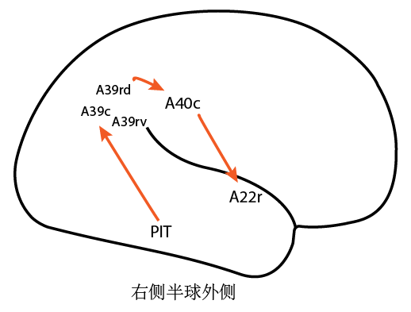
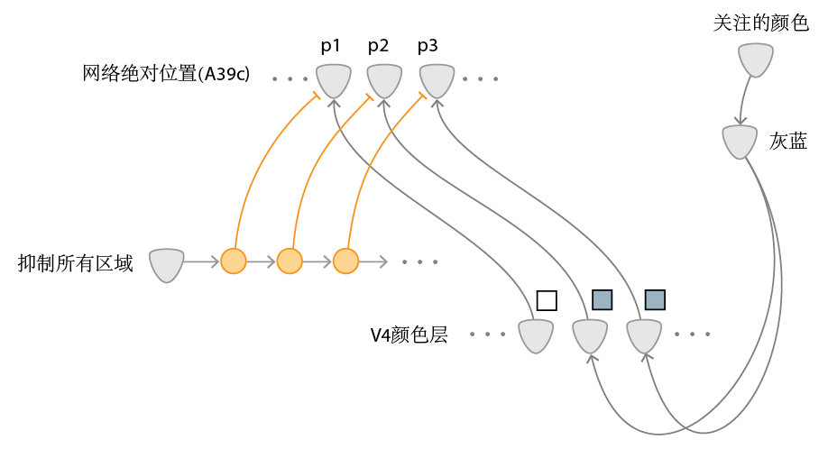

# 整体轮廓识别

## 第一部分：大致通路及处理过程

实现整体轮廓处理的脑区及通路：

大致处理过程：

1. 根据眼睛移动的信号转成【当前眼睛注视的位置】

   由A39rd脑区处理

2. 结合【当前眼睛注视的位置】和【眼内大致特征】记录到视觉短期记忆网络

   由PIT、A39rd脑区到A39c脑区的通路实现

3. 物体背景分离，从视觉短期记忆中提取出物体的部分

   由A39rv脑区处理

4. 提取物体中心、宽度

   由A40c脑区处理

5. 结合物体中心、宽度和网络绝对位置特征，转成相对位置特征

   由A39c、A40c脑区到A22r脑区的通路实现

## 第二部分：神经环路实现

**！！仍在制作**

图 物体背景分离示意（根据颜色对比）

