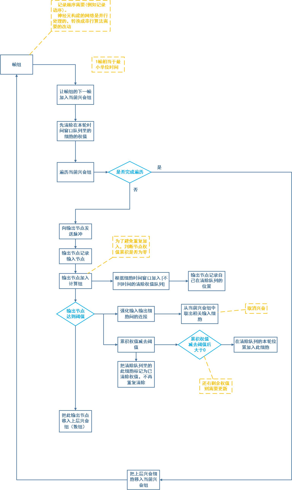

**相关的示意图仍在制作，请过一段时间再回来看！！！**

或者先看下应用例子的原理图 [局部特征学习链接](局部特征识别例子.md)

# 流程图

# 所做的相关优化

- 替代STDP机制

  STDP机制的模拟需要花费过多的计算量，而STDP机制主要的功能是确保同时兴奋的神经元间的连接的强化以及上面所说的分配地址机制。如果用算法实现，那么可以利用上一些数据结构上的优势，从而避免模拟STDP机制，实现同样的功能

- 分配地址机制的优化

  因为不模拟STDP机制，所以分配地址机制要用等价方法实现。

- 兴奋细胞统一为持续兴奋

- 为了减少计算量，适当的把高频率低权值，改成低频率高权值

- 快抑制细胞的优化

  为了减少计算量，高频率脉冲改成单次大权值脉冲，这也能实现同样的功能

- 快抑制细胞的传递性回路

  因为要实现快速抑制，用递归实现

- 利用图这种数据结构存储和查询数据

# 相关设计示意图

**相关的示意图仍在制作，请过一段时间再回来看！！！**
